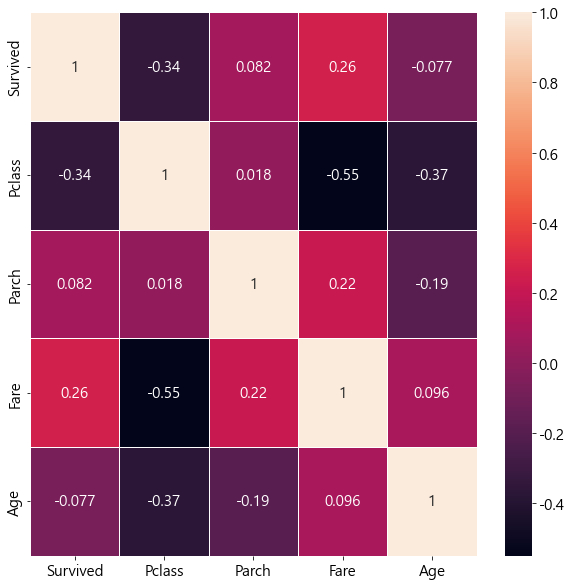

# Visualization

### 1. 시각화

#### 1.1. 시각화란?

데이터 시각화란 숫자, 문자 등의 데이터를 차트 등의 형태로 시각적으로 표현하는 것입니다. 데이터로부터 통찰을 얻고자 하는 업무 Process에서는 크게 네 단계의 과정을 거칩니다.

먼저, **데이터를 가공하고 분석**합니다. 데이터를 분석하고 이해하기 좋은 형태로 가공한 후, 분석을 진행하여 필요한 부분에 관한 통찰을 확인합니다. 다음으로, 확인한 **통찰을 공유하고 전달**하는 과정입니다. 인간은 정보의 80%를 시각으로 처리하기 때문에, 데이터 시각화는 중요한 수단입니다. 데이터 잉크 비율 등을 고려하여 정보 전달의 효율성을 달성하기 위한 데이터 시각화를 진행해야 합니다. 독자는 기존의 정보나 가치 체계 등의 Context 속에서 전달 받은 통찰을 **해석하고 이해**합니다. 마지막으로, 최종 판단 및 **의사 결정을 진행하고 행동을 실행**합니다.

**data 가공 및 분석**

**data 시각화**

**Context 해석 및 이해**

**의사결정 및 실행**

#### 1.2. 시각화 목적

데이터 시각화의 목적은 크게 Information Design, Data Art로 구분합니다. 데이터 시각화를 진행하는 경우, 목적을 분명하게 설정하고 그에 적합한 시각화 전략을 선택해야 합니다.

*   **Information Design**

    Information Design은 특정 업무에서의 활용이나 과제 해결을 목적으로 하는 경우입다. 주관적인 견해를 배제하고 가설이나 사실을 확인하기 위한 목적으로 시각화를 활용합니다. Information Design 유형은 다시 네 가지 유형으로 분류할 수 있습니다.

    가설을 설정하고, 가설의 사실 여부를 검증하기 위해 데이터를 분석하여 시각화하는 경우를 **가설검증형**이라고 합니다. 한편, 지식 체계 확장을 위해 가설을 설정해야 하는 경우에도 시각화를 할 수 있습니다. 이는 **가설탐색형**으로, 경향성이나 통찰 등을 확인하여 검증해야 하는 가설을 발굴하기 위한 목적입니다. Dashboard를 구축하고 주기적으로 현황을 확인하는 등 의사 결정의 기초 자료로 활용하기 위한 목적으로 시각화를 진행하는 경우를 **사실보고형**이라고 합니다. 이 경우의 독자는 시각화 자료에 주관적인 평가나 판단을 부여하여 의사결정을 진행하게 됩니다. **사실설명형**은 사실 그대로를 있는 그대로 기술하여 전달하기 위한 목적으로 시각화를 진행하는 유형입니다.
*   **Data Art**

    Data Art는 자기 주장의 표현을 목적으로 하는 경우입니다. Data Art 유형은 두 가지 유형으로 분류할 수 있습니다.

    **주장 설득형**의 경우, 독자에게 전하고자 하는 메세지를 구성하거나 강화하기 위한 목적으로 사용하는 시각화 유형입니다. 의도적으로 전하고자 하는 메세지와 관련된 부분을 강조하거나 데이터 외적인 시각 자료를 함께 활용할 수 있습니다. 한편, **주장표현형**의 경우 독자를 특정하지 않으며 표현 자체에 목적을 둔 시각화 유형입니다. 이해하기 어려운 시각화를 진행하거나 감성적인 표현을 위한 창작 활동 등이 포함됩니다.

cf ) 사실설명형, 주장표현형을 묶어 **Infographics**라고 지칭합니다. Infographcis는 복잡한 정보를 쉽고 빠르게 전달하기 위해 다양한 기호, 이미지, 차트 등의 시각 자료를 활용하여 정보를 구조적으로 전달합니다.

### 2. Plot 종류와 선택

데이터를 시각화할 때에는 데이터의 유형과 시각화의 목적을 고려하여 정보 전달의 효율성을 극대화할 수 있는 방법을 고안해야 합니다. 따라서 효과적인 시각화를 위해서는 Plot의 종류를 파악하여 각각이 가진 특성을 확인하고 정보 전달 목적에 가장 부합하는 Plot을 선택하는 것이 중요합니다.

Andrew V. Abela(2022)는 데이터를 표현하기 위한 목적과 데이터의 성격에 따라 Plot을 선택하는 기준인 Chart Chooser([https://extremepresentation.typepad.com/files/chart-chooser-2020.pdf](https://extremepresentation.typepad.com/files/chart-chooser-2020.pdf))를 제안했습니다. 이 중, 본 문서에서는 자주 사용되는 몇 가지 Plot과 그 특징에 대해 기술하겠습니다. 시각화에는 Kaggle의 Titanic - Machine Learning from Disaster([https://www.kaggle.com/competitions/titanic/overview](https://www.kaggle.com/competitions/titanic/overview))의 train 데이터와 python의 matplotlib, seaborn 라이브러리를 활용했습니다.

#### 2.1. Histogram

Histogram(hist plot)은 데이터의 분포를 확인하기 위해 가장 먼저 확인할 수 있는 Plot입니다. 특정 속성을 가지고 있는 데이터의 빈도 수를 시각화할 수 있습니다. 데이터 분석에 있어 정규 분포의 가정을 적용할 수 있는지, 혹은 편향은 존재하지 않는지 등의 성질을 확인하기 위해 사용합니다. 극단적으로 많거나 적은 구간의 유형을 확인하기 위해 사용되기도 합니다.

Histogram을 구현할 때에는 변수를 몇 개의 구간으로 나누어 표현할 것인지 결정하는 것이 중요합니다. 너무 많은 구간으로 나누어 표현하면 정보를 읽기 어려울 것이며, 너무 적은 구간으로 나누는 경우 세부 정보를 누락하게 될 가능성이 있습니다. 따라서 데이터의 성격을 확인하고 구간의 적절한 수를 탐색해야 합니다.

아래의 histogram은 타이타닉 생존자 데이터에서 연속형 변수인 나이를 시각화한 것입니다. 왼쪽의 경우에는 전체 구간을 20개 구간으로 나누어 빈도수를 표현하였으며, 오른쪽의 경우에는 5개의 구간으로 나누어 표현하였습니다. 오른쪽의 경우, 10대 이하의 구간에서 영유아의 비중이 많은 비중을 차지한다는 정보를 누락할 가능성이 있습니다.

.png>)

#### 2.2. Box chart

Box chart(Box plot) 역시 한 가지 변수에 대해 분포를 확인하기 위해 사용됩니다. Histogram과 달리 Box chart는 사분위 수 구성의 네 구간만을 이용하여 차트를 구성합니다. 이상치 탐지 방법 중, IQR은 Box chart와 같이 사분위 수 기준을 활용합니다. 따라서, Box chart는 IQR 방식으로 이상치를 따로 표현한 후, 나머지 데이터를 정상 데이터로 분류하고 이들에 대해서만 Box chart를 구성합니다. 극단적인 값을 가지는 이상치의 수와 정도를 확인할 때에 가장 먼저 사용할 수 있는 Plot입니다.

아래는 타이타닉 생존자 데이터에서 나이(왼쪽)와 운임(오른쪽)의 분포를 각각 표현한 것입니다. Age의 경우에는 20대와 40대의 간격이 다른 구간보다 짧게 표현되어 여기에 많은 비중의 인원이 분포하고 있음을 확인할 수 있습니다. 한편, Fare와 비교했을 때 데이터가 편중된 정도가 심하지 않으며, 적은 수의 이상치를 가진 데이터라는 사실을 확인할 수 있습니다.

.png>)

#### 2.3. Scatter chart & Bubble chart

Scatter chart는 집계가 아닌, 모든 개별 데이터들을 좌표 평면에 점으로 표현합니다. Histogram과 Box chart가 단일 변수에 따른 분포를 확인한다면, Scatter chart는 둘 이상의 변수에 대해 데이터의 분포를 확인하기 위해 사용합니다. 표현된 점들에서 일정한 패턴이 발견된다면 두 변수 사이의 관계를 정의하기 위한 기초 자료로 활용될 수 있습니다. 특히 상관관계 패턴을 파악하기 위해 사용합니다.

Bubble chart는 Scatter chart에 한 종류의 변수를 추가하여 총 세 종류의 변수를 표현할 수 있게 만든 차트입니다. 첫 두 개의 변수는 각각 X축, Y축으로 사용하게 되며, 세 번째 변수는 점의 크기로 구분하여 표현합니다. 즉, Scatter chart에서 점들의 크기가 각각 달라 거품처럼 보이게 만든 것이 Bubble chart입니다. 점의 크기라는 새로운 요소를 사용한다는 측면에서 Scatter chart에 비해 더 많은 정보를 표현할 수 있습니다.

Scatter chart와 Bubble chart에는 범주형 변수를 추가하여 점들을 색깔로 묶어서 표현할 수 있습니다. Seaborn에서는 hue 인자로 받아서 표현하며, Tableau에서는 색상 선반을 이용하여 표현합니다. 전체를 시각화했을 때 규칙성이 없어보이는 데이터라도, 색깔을 이용해 범주를 구분하여 표현하면 숨은 패턴이나 통찰을 확인할 수 있는 경우도 있습니다.

아래는 타이타닉 생존자 데이터에서 연속형 변수인 나이와 운임을 활용하여 Scatter chart(왼쪽)와 Bubble chart(오른쪽)로 각각 표현한 것입니다. 성별을 이용해 색깔을 구분하였으며 Bubble chart는 Pclass로 점의 크기를 구분한 것입니다. 일반적으로 Scatter chart보다 Bubble chart에서 더 많은 정보를 표현할 수 있습니다. Bubble chart에서는 Pclass의 숫자가 낮을 수록 높은 Fare를 지불했다는 정보를 확인할 수 있습니다. 한편, Bubble chart에는 여러 변수가 동시에 표현되어 읽어야 하는 쟁점을 놓칠 수 있습니다. 나이와 성별 변수가 한 차트 안에 섞여있기 때문에 독자는 메세지와 관련이 떨어지는 정보까지도 받아들이게 됩니다. 이 경우, 새로운 차트를 활용하여 재구성할 필요가 있습니다.

.png>)

#### 2.4. Line chart & Radar chart

Line chart는 데이터가 위치한 점들을 선으로 연결하여 표현하는 방법입니다. 왼쪽에서 오른쪽으로 이어지는 선을 따라 시선이 이어지기 때문에 데이터의 변화를 표현하기 위해 사용합니다. 특히 시간에 따라 변화하는 패턴에 대해 확인하고자 할 때 많이 사용합니다. 이중축을 활용하는 경우, Bar chart 로 표현할 수 있는 데이터를 Line chart로 표현하기도 합니다.

Radar chart는 셋 이상의 데이터를 동시에 놓고 비교하기 위해 사용합니다. Line chart와 달리, 한 변수에 대해서 하나의 값만을 표현할 수 있기 때문에 한 시점이나 한 개체에 대해 단면적인 표현이 가능합니다. 값의 범위나 속성의 성격이 비슷한 변수들을 모아서 표현하는 것이 효과적이며, 원 위에 다양한 변수를 놓고 특정 방향으로 값의 편향이 존재하는지 표현하기에 용이합니다.

아래는 타이타닉 생존자 데이터를 각각 Line chart(왼쪽)와 Radar chart(오른쪽)로 표현한 예시입니다. Line chart의 경우에는 Parch가 변화함에 따라 Avg\_Fare가 달라지는 상태를 확인할 수 있습니다. 한편, Radar chart에서는 특정 타이타닉 탑승객 한 명에 대해서만 표현하고 있습니다. Parch 변수에 대해 하나의 값만을 표현하는 대신 Age, SibSp, Pclass 등 둘 이상의 여러 변수들과 함께 놓고 비교할 수 있습니다.

.png>).png>)

#### 2.5. Bar chart & Pie chart

Bar chart는 가장 기본적인 형태의 그래프로, 사각 기둥의 길이를 활용하여 수치를 시각화하는 방법입니다. 기둥이라는 의미를 담아서 R의 ggplot2의 경우, 일반적인 막대 그래프를 ‘col’이라고 지칭하기도 합니다. 주로 수치적인 데이터 혹은 빈도수의 대소 관계를 비교하기 위해 활용됩니다.

Pie chart는 전체 중에서 차지하는 비중을 시각화하는 방법으로, 원에서 차지하는 비중을 총 360˚의 각도와 면적으로 배분하여 표현합니다. Pie chart에서 원의 중앙을 비운 형태를 Doughnut chart라고 부르며, 비운 공간을 제목이나 관련된 정보를 삽입하는 방식으로 활용할 수 있습니다. Doughnut chart의 경우, Pie chart에 비해 중심각을 이용한 시각 정보 전달 측면에서 불리합니다.

Bar chart와 Pie chart의 효과에 관련한 논의가 있습니다. ([https://priceonomics.com/should-you-ever-use-a-pie-chart/](https://priceonomics.com/should-you-ever-use-a-pie-chart/)) Bar chart의 경우, 직선적인 정보처리 방향을 활용하기 때문에 여러 수치를 비교하기에 적합합니다. 한편, Pie chart의 경우 각도와 면적 정보를 활용하여 정보를 제공하기 때문에 전체에서 차지하는 비중을 비교하는 목적으로 활용하기에는 적합하지 않을 수 있습니다.

아래는 타이타닉 생존자의 Pclass 분포입니다. Pie chart에서는 1 class와 3 class 중, 어느 class의 생존자가 더 많은 지 분명하게 전달하기 어렵습니다. 한편, Bar chart에서는 1 class가 가장 많은 비중을 차지한다는 것을 확실게 표현할 수 있습니다.

.png>)

한편, Bar chart의 경우 전체에 대한 표현이 어렵기 때문에 각 요소가 전체에서 차지하는 비중을 표현하기에는 부적합합니다. Stacked Bar chart를 사용하더라도 직선적이고 연속적인 시각 정보를 활용하기 때문에 전체에서 차지하는 비중을 가늠하기에 불리합니다. 따라서 아래와 같이 전체와 구성 요소의 비중에 정보 전달의 목적이 있는 경우, Bar chart보다 Pie chart를 활용하는 것이 효과적일 수 있습니다.

아래는 타이타닉 생존자의 세대 분포입니다. Bar chart에서는 20대 이하의 비중이 가장 크다는 것을 확인할 수 있지만, 모든 세대를 모두 합한 전체에서 차지하는 비중을 확인하기에 어려움이 있습니다. Pie chart에서는 Pie chart에서는 20대 이하의 비중이 절반에 조금 미치지 못하는 수준으로 차지하고 있다는 점을 효과적으로 전달할 수 있습니다.


#### 2.6. WordCloud

WordCloud는 단어의 등장 빈도를 글자의 크기로 표현하여 자주 등장하는 단어를 크게 표현합니다. 빈도 수를 비교하기 위해서 Bar chart를 사용할 수도 있습니다. 하지만 Bar chart에서는 자주 등장하는 단어의 빈도수가 막대의 길이로 표현될 뿐, 단어를 강조하기에는 어려움이 있습니다. WordCloud를 사용하면 빈도수의 정확한 비교는 어렵지만, 자주 등장하는 단어를 명확하게 전달하기 위한 목적으로 사용하기에는 적합합니다.

아래는 타이타닉 생존자 데이터에서 자주 등장하는 이름을 Bar chart(왼쪽)와 WordCloud(오른쪽)로 표현한 것입니다. Bar chart에는 많은 수의 단어를 한 축에 담을 수 없게 되는 문제가 발생했습니다. 많은 수의 문자 데이터를 시각화한다면 WordCloud를 고려해보는 것이 좋습니다. WordCloud에서도 Mr.와 Miss. 등의 표현은 이름에 해당하는 단어는 아니기 때문에 데이터 분석 과정에서 사전에 제거(불용어 처리)하는 것이 좋습니다.

.png>).png>)

#### 2.7. Pair plot & Heat map

Pair plot과 Heat map은 여러 변수들 사이의 관계를 한꺼번에 표현하기 위해 사용합니다.

Pair plot의 경우 교차되는 두 변수를 이용하여 Scatter plot으로 표현하며, 교차되는 두 변수가 같은 경우에는 Histogram으로 표현해 분포를 확인할 수 있습니다. 여러 변수에 대해 분포를 확인해야 한다면 Pair plot 하나로 해결할 수 있습니다.

Heat map은 변수들 사이의 상관 계수를 색 온도를 사용해 보여줍니다. Scatter plot은 주로 변수들 사이의 상관 관계를 파악하기 위해 사용합니다. 개별 데이터의 분포가 중요하지 않고 상관 관계를 확인해야 하는 경우, 구체적인 수치와 함께 표현되는 Heat map을 사용하면 전반적인 변수들의 상관 관계를 확인하기에 용이합니다. Heat map은 단순히 큰 숫자를 더 높은 온도의 색으로 표현하는 Plot이기 때문에 상관 계수가 아닌 숫자라도 대소관계 비교를 위한 시각화에 활용할 수 있습니다.

아래는 타이타닉 생존자 데이터에서 Survived, Pclass, Parch, Fare, Age 다섯 가지 변수에 대해 Pair plot(왼쪽)과 Heat map(오른쪽)으로 각각 표현한 자료입니다. Pair plot은 Heat map에 비해 구체적인 데이터의 분포를 확인할 수 있는 반면, 독자가 받아들여야 할 정보량이 매우 많다는 특징이 나타납니다.

.png>)

#### 2.8. Others

Plot은 전달력을 높이기 위해 다양한 방법으로 변형되거나 새로 만들어질 수 있습니다.

Box plot은 데이터의 분포가 직관적으로 받아들여지지 않다는 한계가 있습니다. 이러한 문제에 대한 보완으로 Violin plot 등의 형태로 변형하여 활용할 수 있습니다. Line chart의 경우에는 그 아래 면적에 색을 입혀 강조하는 Area plot으로 변형할 수 있습니다. 전체에서 차지하는 비중을 Pie chart의 원이 아닌 사각형으로 바꾸어 표현하면 Tree map의 형태를 활용할 수 있습니다.

Pair plot과 같이, 여러 개의 Plot을 동시에 표현하는 방법들이 있습니다. 같은 종류의 그래프를 다른 색깔로 구분하여 겹쳐서 비교할 수 있도록 시각화하는 방법도 있으며, 다른 종류의 그래프를 섞어 하나의 차트에서 여러 정보를 한 번에 전달할 수도 있습니다.

위에서는 2개의 축으로 표현하는 시각화만 다뤘다면, 3개의 변수를 활용하여 3D graph를 활용하여 입체 공간에서 데이터를 표현하는 방법도 있습니다. 지도 위에 위도와 경도를 사용하여 위치 정보를 시각화할 수 있습니다.

더 다양한 종류의 Plot은 ([https://datavizcatalogue.com/](https://datavizcatalogue.com/))에서도 확인할 수 있습니다.

### 3. 시각화 수단

#### 3.1. Excel

데이터가 작성된 Sheet에서 직접 차트를 작성할 수 있습니다. \[삽입] 탭에서 Bar chart, Line chart, Pie chart, Doughnut chart, Treemap, Histogram, Box plot, Scatter plot, Bubble plot, Radar chart, Combo chart, 3D map 등 다양한 종류의 차트를 지원합니다.

Excel을 이용하여 시각화하는 경우, Sheet에서 데이터가 변경되면 즉각 차트에 반영되는 연동성을 활용할 수 있습니다. 따라서 작은 규모의 데이터를 시각화하여 현황을 파악하기 위한 Dashboard를 구성하기에 유용합니다. 단, 데이터 규모가 커질 수록 Excel의 성능이 저하되어 속도가 느려지는 경우가 많습니다.

#### 3.2. Tableau

Business Inteligence 프로그램으로, 다양한 형태로 저장된 데이터를 불러와 시각화할 수 있습니다. Excel과 비교했을 때, 여러 종류의 Database와 Table을 불러와 한 작업 공간에서 처리할 수 있다는 장점이 있습니다. \[데이터 원본] 탭에서 다수의 Table을 불러오는 것이 가능하며, 간단하게 데이터의 모습을 확인할 수 있습니다. 또한, 간편하게 Join이 가능하기 때문에 여러 Table을 통합해 하나로 통합해 시각화 활용성을 높일 수 있습니다.

Tableau는 시각화 자료를 세 단계의 형태로 구성할 수 있다는 점이 특징입니다. 하나의 차트를 표현하는 **워크시트**, 같은 주제를 표현하는 여러 워크시트를 모아 한 화면에 표현하는 **대시보드**, 여러 대시보드를 모아 순서를 구성한 **스토리** 세 단계의 형태로 시각화 자료를 구성할 수 있습니다.

테이블이 포함하고 있는 여러 열을 **데이터 선반**에 Drag-n-Drop 하는 방식으로 간편하게 시각화를 진행할 수 있습니다. 데이터 선반은 열, 행, 값, 필터, 색상, 크기, 텍스트, 세부정보 등 차트를 구성하는 요소로, 이에 해당하는 각각의 선반이 존재합니다. Text table, Heat map, Highlight uable, Map, Pie chart, Bar chart, Tree map, Line chart, Scatter chart, Bubble chart, Histogram view, Box plot, Gant chart 등 다양한 유형의 차트를 지원합니다. 선택한 데이터와 선반의 유형에 따라 표현에 적합한 차트를 프로그램이 추천하여 초기 차트를 만들어준다는 점에서 편리합니다. 특히, 지리적 정보와 관련된 시각화를 진행할 때에 위치 정보 데이터에 대한 깊은 이해가 없어도 쉽게 지도 시각화를 할 수 있기 때문에 진입 장벽이 낮습니다.

Tableau를 활용하여 시각화하는 경우, **집계 처리 개념**에 대한 이해가 필요합니다. Tableau는 선택한 열의 값을 활용하여 합계/평균/중앙값 등의 집계값의 형태로 표현합니다. 따라서 활용하고 있는 데이터에 식별자가 존재하지 않는다면 시각 자료를 개별 데이터 단위에서 표현하는 것은 불가능합니다. 또한, 시각화에 특화된 프로그램이기 때문에 **데이터를 편집하기에는 어려움**이 있습니다. 대신 시각화 보조수단으로서 계산 필드, 매개변수, 집합 등의 기능을 활용하여 데이터를 가공하여 사용하는 효과를 이용할 수 있습니다.

tableau public([https://public.tableau.com/](https://public.tableau.com/))을 이용하면 다른 사람들의 시각화 방법이나 아이디어를 확인할 수 있으며, 개인의 시각화 자료들 역시 공유하거나 정리해둘 수 있습니다. 학생용 Tableau([https://www.tableau.com/ko-kr/academic/students](https://www.tableau.com/ko-kr/academic/students))를 활용하면 학생용 계정을 발급받아 1년 간 무료 사용이 가능합니다.

#### 3.3. Python

*   matplotlib, seaborn

    matplotlib과 seaborn은 Python에서 대표적인 시각화 라이브러리입니다. matplotlib은 주로 차트의 큰 틀을 설정하기 위해 활용하며, seaborn은 구체적인 plot을 결정하고 plot의 세부 요소들을 설정하기 위해 사용됩니다.

    matplotlib은 python의 numpy 라이브러리를 활용하여 plot을 구조화할 수 있게 하는 라이브러리입니다. 시각화에서 활용할 때에는 matplotlib의 pyplot을 호출하여 사용하며, plt라는 약어로 활용하는 것이 일반적입니다.

    ```python
    from matplotlib.pyplot import plt
    %matplotlib inline
    ```

    pyplot의 method들을 활용하면 차트의 축 설정부터 plot의 종류까지 모든 구성 요소를 설정할 수 있습니다. 따라서 세부 기능을 잘 활용한다면 모든 형태의 차트를 만들 수 있습니다. 한편, 세부적인 모든 요소들을 직접 정의해주어야 합니다. pie chart 등 matplotlib에서 지원하는 몇 가지 간단한 차트를 제외하면 많은 설정 값을 지정해주어야 차트를 구현할 수 있습니다. 따라서 matplotlib에서 큰 틀만 설정해주고 seaborn으로 세부적인 plot을 구성하는 것이 일반적입니다. 대표적으로, matplotlib.pyplot의 내장 함수인 figure 함수를 활용하면 차트의 전체 크기를 결정할 수 있으며, subplots 함수를 이용하면 여러 plot을 한 번의 출력에 담아낼 수 있습니다.

    seaborn은 matplotlib 기반으로 자주 사용하는 유형의 차트들을 간편하게 구현할 수 있도록 만들어진 라이브러리입니다. matplotlib 기반이기 때문에 함께 호출하여 사용하기도 하며, 주로 sns라는 약어로 활용합니다. Pandas의 DataFrame 데이터 타입을 투입하여 그래프를 그리는 것이 가능하기 때문에 Pandas를 활용한 데이터 분석 과정에서 유용합니다.

    ```python
    from seaborn as sns
    from matplotlib.pyplot import plt
    %matplotlib inline
    ```

    seaborn은 scatterplot, lineplot, hisplot, kdeplot, rugplot, boxplot, pointplot, barplot, pairplot, clustermap 등 matplotlib을 기반으로 다양한 종류의 plot을 제공하고 있습니다.
*   Plotly

    Plotly는 Python 뿐 아니라 R, Javascript 등 다양한 언어와 플랫폼에서 반응형 차트 제작을 지원하는 라이브러리입니다. plotly의 express 모듈을 호출하여 사용하며, 주로 px라는 약어로 활용합니다.

    ```python
    import plotly.express as px
    ```

    Plotly는 차트를 이미지 파일로 다루어 출력하는 matplotlib과 달리, 반응형 차트를 출력합니다. 마우스를 이용한 움직임을 활용하여 이미지 저장, 확대, 부분 선택, 정확한 수치 확인 등 시각화 자료를 간단하게 변형하거나 세부적인 정보를 확인할 수 있습니다.

    matplotlib의 구문을 활용하여 그래프로 표현하고자 하는 모든 세부사항을 지정하여 표현하는 것이 가능한 동시에, plotly가 기본적으로 제공하는 다양한 종류의 차트들을 그대로 호출하여 사용할 수도 있습니다. plotly는 기본적인 Scatter plots, Line charts, Bar chars, Pie charts, Bubble charts, Box plots 뿐만 아니라 지도나 머신러닝을 활용하는 종류의 차트 예제 역시 지원하고 있습니다. 3D 공간의 그래프를 반응형 차트로 보여주기 때문에 다양한 각도에서 돌려보며 그래프를 이해할 수 있다는 강점을 가지고 있습니다.
*   folium

    folium은 지리적인 데이터의 시각화에 특화된 라이브러리입니다. Leaflet.js를 기반으로 하여 반응형 지도를 제공하기 때문에 시각화 이후에 독자가 자유롭게 지도를 살펴볼 수 있는 UI를 제공합니다.

    ```python
    import folium
    ```

    위도와 경도로 표현된 정보는 데이터보다 지도에서 시각적인 정보로 위치를 파악하는 것이 더 용이합니다. folium은 현실의 지도를 기반으로 구성되어있어 데이터를 표현하기 위해서 지리적 정보 데이터를 시각화하고자 할 때 유용합니다.

    한편, 지리 정보와 관련된 data는 다양한 기관이나 단체에서 다양한 형식으로 제공하고 있습니다. 따라서 시각화의 의도를 잘 구현하기 위해서는 geoJSON 등 지리 정보와 관련한 데이터의 표현 형식들에 대한 이해가 필요합니다.

#### 3.4. R

R을 이용하여 데이터 분석을 진행하는 경우, ggplot2를 활용하여 시각화할 수 있습니다.

```r
# packages 설치
install.packages("ggplot2")
# library 부착
library(ggplot2)
```

ggplot2는 데이터와 그래프에 사용될 축을 사전에 정의합니다. 사전에 정의된 ggplot 데이터에 덧셈 연산을 활용해 이를 표현할 데이터의 종류를 지정하면 그래프가 표현됩니다. 사전에 정의한 ggplot 데이터를 활용하여 표현할 수 있는 여러 가지 그래프 종류를 적용해볼 수 있습니다. 따라서 데이터에 대한 배경 지식이 부족하여 데이터를 표현할 적합한 그래프 종류를 탐색하기에 용이합니다.

R studio와 그 라이브러리들은 접근성을 높이기 위해 사용 설명을 담은 각각의 Cheat Sheet를 제공하고 있습니다. ggplot2 역시 표현할 수 있는 그래프의 종류를 Cheat Sheet([https://github.com/rstudio/cheatsheets/blob/main/data-visualization.pdf](https://github.com/rstudio/cheatsheets/blob/main/data-visualization.pdf))로 만들어보다 편리하게 필요한 코드를 찾아볼 수 있게 제공하고 있습니다.
